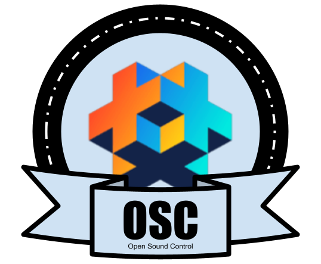

# Open Sound Control Library

## Overview


Open Sound Control (OSC) is an open, transport-independent, message-based protocol developed for communication among computers, sound synthesizers and other multimedia devices.  

This library aims to provide the [OSC 1.0](http://opensoundcontrol.org/spec-1_0.html) protocol to any defold application.  
It's a pure lua implementation, there's no platform dependent librarie.


## Installation

You can use OSC in your own project by adding this project as a [Defold Library dependency](https://defold.com/manuals/libraries/). Open your **game.project** file and in the **dependencies** field under **project** add:

	https://github.com/Brun0oO/defold-osc/archive/master.zip

Or point to the ZIP file of a [specific OSC release](https://github.com/Brun0oO/defold-osc/release).


## Basic usage
### Receiving of messages
Create a script with the following code, add it to a game object:

```lua
local osc = require('osc.init')
local plugin = require('osc.plugins.udp-socket-non-blocking')

function init(self)
	-- Initialize the osc mechanism
	local udp = plugin.new {
		recvAddr = 'localhost',
		recvPort = 9000,
		ignore_late = true, -- ignore late bundles
	}
	self.osc = osc.new {plugin = udp}
	
	-- Bind the receipt of a message to a dedicated callback
	self.osc:add_handler('/foo/bar', function(data)
		local msg = data.message
		print('Received OscMessage  => address: ' .. msg.address, 'timestamp: ' .. data.timestamp)
		for index, argument in ipairs(msg) do
			print('  arg index: ' .. index, ' value: ' .. argument)
		end
	end)
	
	self.osc:open()
end

-- Very important call to handle sockect reading and the receipt of messages !!
function update(self, dt)
	self.osc:update() 
end

```

Have a look to the example folder !o)

### Sending of messages
Create a script with the following code, add it to a game object:

```lua
local osc = require('osc.init')
local plugin = require('osc.plugins.udp-socket-non-blocking')

function init(self)
    -- Initialize the osc mechanism
	local udp = plugin.new {
		recvAddr = 'localhost',
		recvPort = 9000,
		ignore_late = true, -- ignore late bundles
	}
	self.osc = osc.new {plugin = udp}
	
	-- Create a message
	local message = osc.new_message {
	  address = '/foo/bar',
	  types = 'ifsb',
	  123, 1.234, 'hi', 'blobdata'
	}

	-- Send it over UDP
	self.osc:send(message)
end


```

## Contributing
There are probably bugs. Please report them!  
Did you improve some of the code? Have a look to [CONTRIBUTE.md](./CONTRIBUTE.md) for details about how to contribute to this project.

## Credits

* OSC 1.0 implementation for lua and luajit from [davidgranstrom/losc](https://github.com/davidgranstrom/losc)
